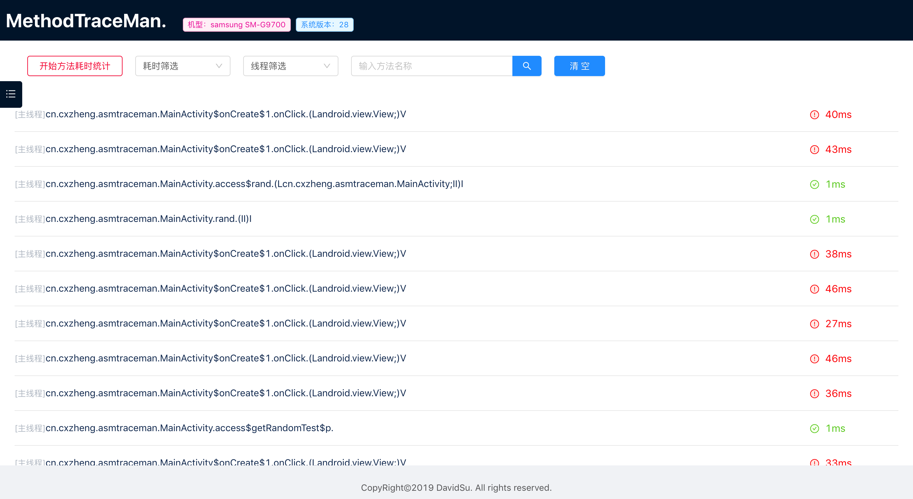
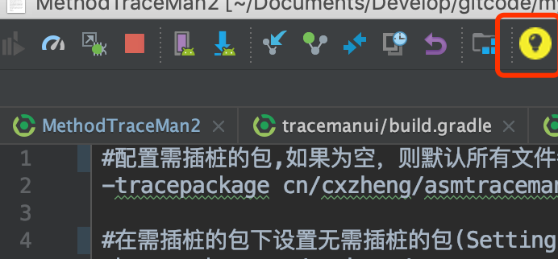
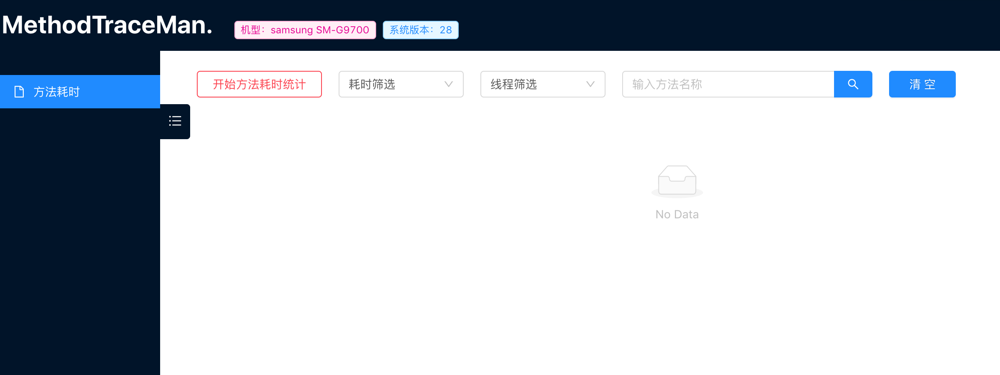
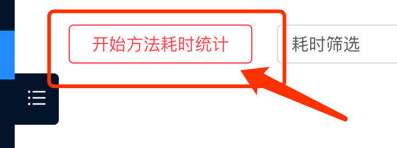
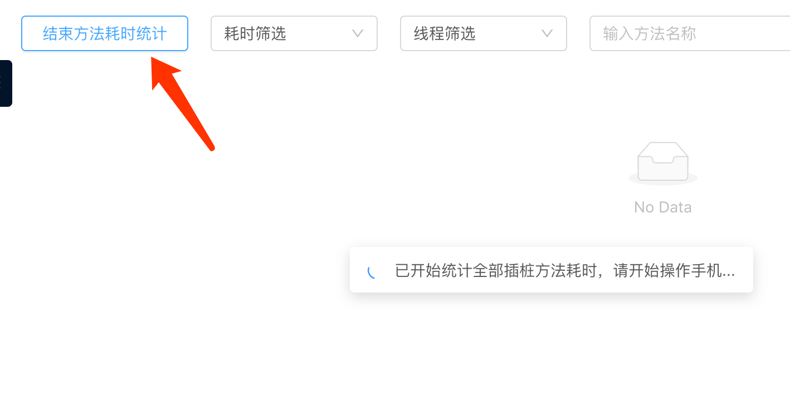
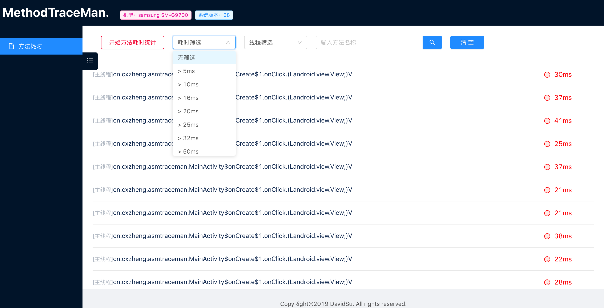

# MethodTraceMan

<p>
<a href="README.md">中文</a>&nbsp;&nbsp;&nbsp;
<a href="README_en.md">English</a>
</p>

用于快速找到高耗时方法，定位解决Android App卡顿问题。通过gradle plugin+ASM实现可配置范围的方法插桩来统计所有方法的耗时，并在浏览器提供友好的界面展示，支持耗时筛选、线程筛选、方法名筛选等。


## 预览



### 整个项目包括三部分：

1. 方法耗时数据收集部分：通过gradle plugin+ASM在编译时期对所有方法进行插桩收集方法耗时数据，并进行处理
2. 方法耗时数据展示部分：在浏览器上展示方法耗时数据，并支持耗时筛选、线程筛选、方法名搜索等功能
3. AndroidStduio插件：用于方便在AndroidStduio顶部栏上快速打开方法耗时数据展示部分【即上面说的第二部分】

### 实现及原理
详见我的博客：[App流畅度优化：利用字节码插桩实现一个快速排查高耗时方法的工具](https://juejin.im/post/5da33dc56fb9a04e35597a47)


## QuickStart

### Step1 集成与配置

#### root project `build.gradle`

```groovy
buildscript {
    repositories {
        google()
        jcenter()
        maven { url 'https://jitpack.io' }
        maven { url "https://plugins.gradle.org/m2/" }
    }
    dependencies {
        classpath "gradle.plugin.cn.cxzheng.methodTracePlugin:tracemanplugin:1.0.3"
    }
}

allprojects {
    repositories {
        google()
        jcenter()
        maven { url 'https://jitpack.io' }
        maven { url "https://plugins.gradle.org/m2/" }
    }
}
```

#### app module project `build.gradle`

```groovy
dependencies {
  debugImplementation 'com.github.zhengcx:MethodTraceMan:1.0.6'
  releaseImplementation 'com.github.zhengcx:MethodTraceMan:1.0.5-noop'
}

apply plugin: "cn.cxzheng.asmtraceman"
traceMan {
    open = true //这里如果设置为false,则会关闭插桩
    logTraceInfo = false //这里设置为true时可以在log日志里看到所有被插桩的类和方法
    traceConfigFile = "${project.projectDir}/traceconfig.txt"
}
```
release包下依赖的是noop包，里面不会做任何操作，也不会增加包大小。

#### 在App启动时对MethodTraceMan进行初始化
在app启动时（在Application类或者MainActivity中）对MethodTraceMan进行初始化，如下：
```kotlin
MethodTraceServerManager.startService(context)
```
**注意:** 以上是Kotlin代码，如果是java代码中，请调用：
```java
MethodTraceServerManager.INSTANCE.startService(context);
```

#### 在app module的根目录下创建一个名叫`traceconfig.txt`的配置文件，并在里面对插桩范围进行配置
下面是配置示例：
```txt
#配置需插桩的包,如果为空，则默认所有文件都进行插桩(config the package need to trace,If they are empty, all files are traced by default.)
-tracepackage cn/cxzheng/asmtraceman

#在需插桩的包下设置无需插桩的包(Setting up traceless packages under packages that require trace)
#-keeppackage cn/cxzheng/asmtraceman/test

#在需插桩的包下设置无需插桩的类(Setting up traceless classes under packages that require trace)
#-keepclass cn/cxzheng/asmtraceman/MainActivity

#插桩代码所在类,这里固定配置为：cn/cxzheng/tracemanui/TraceMan(Fixed configuration here: cn/cxzheng/tracemanui/TraceMan)
-beatclass cn/cxzheng/tracemanui/TraceMan
```

**注意：** -tracepackage 后面是需要改成你自己项目中想配置插桩范围的包名，以斜杆分割如cn/cxzheng/asmtraceman,错误示范:cn.cxzheng.asmtraceman

#### 在AndroidManifest.xml中检查是否开启了网络权限，如果没有的话，请开启网络权限
```xml
<uses-permission android:name="android.permission.INTERNET" />
<uses-permission android:name="android.permission.ACCESS_NETWORK_STATE" />
 <uses-permission android:name="android.permission.ACCESS_WIFI_STATE" />
```

#### 最后，Rebuild项目并运行安装你的app,所有方法就会进行耗时插桩


### Step2 安装AndroidStduio辅助插件: MethodTraceMan

这个插件的主要功能是可以在AndroidStduio上快速方便的打开methodtraceman的UI界面，这个插件已上传AndroidStduio的插件仓库，你可以通过在AndroidStduio插件库中搜索`MethodTraceMan`来安装这个插件，当然在项目的aspluin目录下也提供了该插件的jar包，具体如何安装AndroidStduio插件，这里就不细说了，可以在网上搜索，安装好之后重启AndroidStduio，就可以在顶部栏看到MethodTraceMan插件的黄色灯泡💡图标了，集成和安装到这里就介绍完毕了，下面我会介绍MethodTraceMan如何使用。

安装后重启，图如下：

**注意：** 如果重启AndroidStduio后在顶部栏没发现小灯泡图标，请检查AndroidStduio顶部栏View->Toolbar是否勾选上。



### Step3 使用介绍
完成上面两步后，确保已完成：

1. 按要求集成后，Rebuild&Run 启动你的App
2. AndroidStduio上已安装好MethodTraceMan插件

接下来会介绍如何使用MethodTraceMan来方便的排查高耗时的方法：

#### 1.将手机通过Usb连接电脑，确保连接成功。

#### 2.启动APP后，此时点击AndroidStduio顶部栏的MethodTraceMan灯泡小图标，则会在浏览器上打开MethodTraceMan的UI界面如下：




#### 3.点击“开始方法耗时统计按钮”，然后开始随意操作你的app


#### 4.操作完app后，点击“结束方法耗时统计”按钮，此时会输出所有方法的耗时统计，你可以进行耗时筛选、线程筛选、方法名搜索等进行筛查





## 问题排障

日志排障详见：<a href="问题排障.md">问题排障</a>

**注意事项：**
* 请不要同时打开两个集成了此项目的App,会导致耗时数据无法传送到浏览器的UI界面
* 请不要同时连接两个手机，会导致浏览器打开界面失败
* 集成进自己的项目的话，请务必记得将traceconfig.txt中 -tracepackage配置成自己想插桩的包范围
* 如果重启AndroidStduio后在顶部栏没发现小灯泡图标，请检查AndroidStduio顶部栏View->Toolbar是否勾选上


## End 欢迎Star/Fork/Issue.

**集成及使用过程中有任何问题或者建议，欢迎与我进行交流，谢谢**


## License

Apache2.0.


## About Me

- Github: [DavidSu](https://github.com/zhengcx)
- 博客: [舒大飞](https://juejin.im/user/5a6d2293518825734a74ed4c/posts)
- WeChat：zcx7hao
