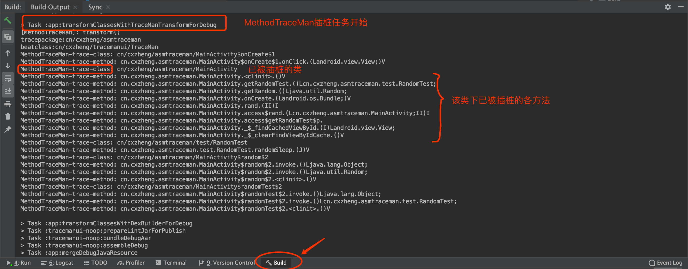
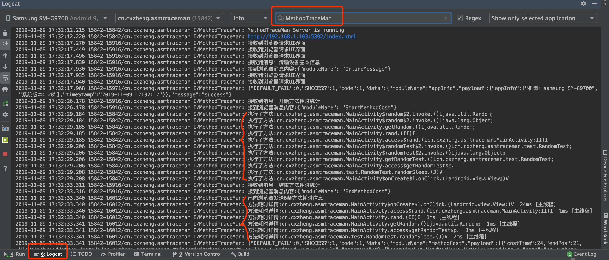
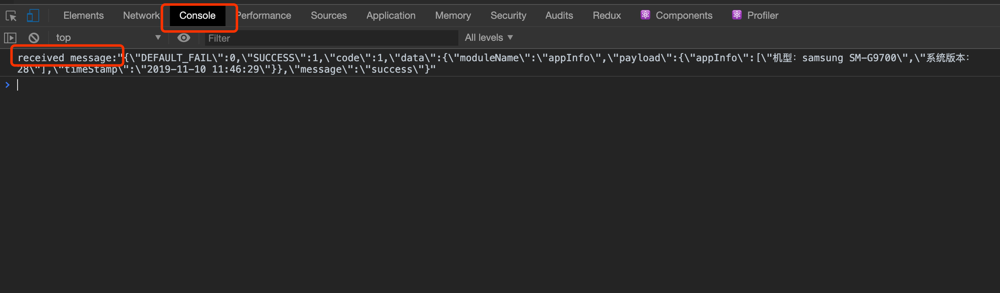

# MethodTraceMan问题排障
当集成完MethodTraceMan项目后，Rebuild项目并启动app后，遇到没有成功输出方法耗时数据时，`第一步请先阅读以下的几个注意事项`，看是否有存在问题：
* 请不要同时打开两个集成了此项目的App,会导致耗时数据无法传送到浏览器的UI界面
* 请不要同时连接两个手机，会导致浏览器打开界面失败
* 集成进自己的项目的话，请务必记得将traceconfig.txt中 -tracepackage配置成自己想插桩的包范围
* 如果重启AndroidStduio后在顶部栏没发现小灯泡图标，请检查AndroidStduio顶部栏View->Toolbar是否勾选上


当上面的注意事项都排查过没有问题，依然无法成功输出数据时，则需要`启动项目内部的日志来排查问题`了，整个项目主要包括：插桩、数据处理、发送数据、接收数据、展示数据等几个过程，所以我们在这几个重要过程都添加了详细的日志，遇到问题可以首先通过以下几个配置来打开详细的日志输出：

## 打开详细日志输出配置

1.build.gradle中打开`logTraceInfo`开关，则会在Rebuild过程中输出所有被插桩的类和方法

```groovy
apply plugin: "cn.cxzheng.asmtraceman"
traceMan {
    open = true //这里如果设置为false,则会关闭插桩
    logTraceInfo = true //这里设置为true时可以在log日志里看到所有被插桩的类和方法
    traceConfigFile = "${project.projectDir}/traceconfig.txt"
}
```

2.初始化MethodTraceMan项目时，如Application或者MainActivity的onCreate()中添加如下代码，设置日志输出级别为`详细`，如下配置即可：

```kotlin
MethodTraceServerManager.logLevel = MethodTraceServerManager.MTM_LOG_DETAIL
```

## 排障

1.首先通过观察Build下的编译日志来看看是否插桩成功（会输出所有被成功插桩的类和方法）



2.在Logcat下筛选关键字`MethodTraceMan`,观察各个流程的详细日志输出，看看哪个流程有问题，最后结束耗时统计的时候是否发送了耗时数据给浏览器等



3.如果通过第二步的排查确定已经将数据正确的发送给了浏览器，那么最后一步就是排查浏览器是否正确的接收到了，打开浏览器的检查->Console查看输出即可。

